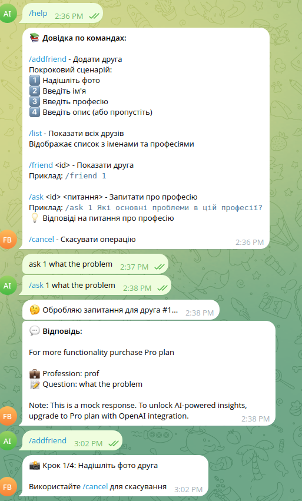
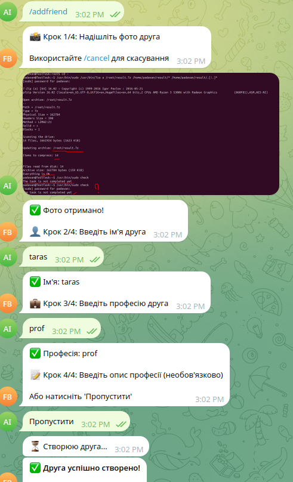
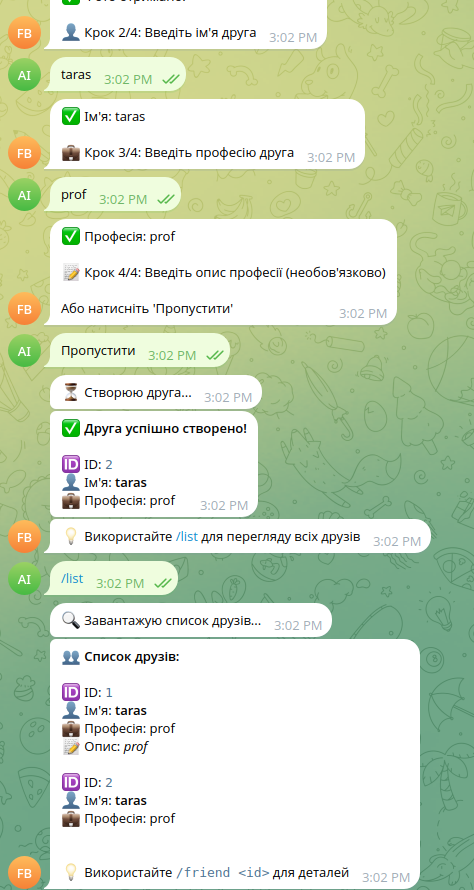
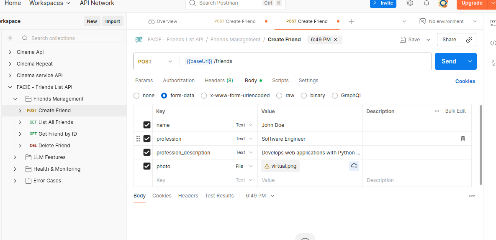
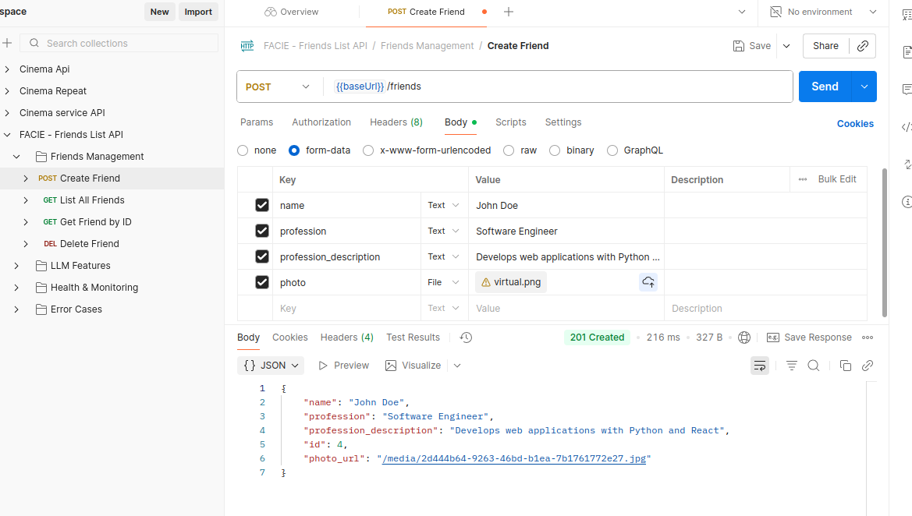
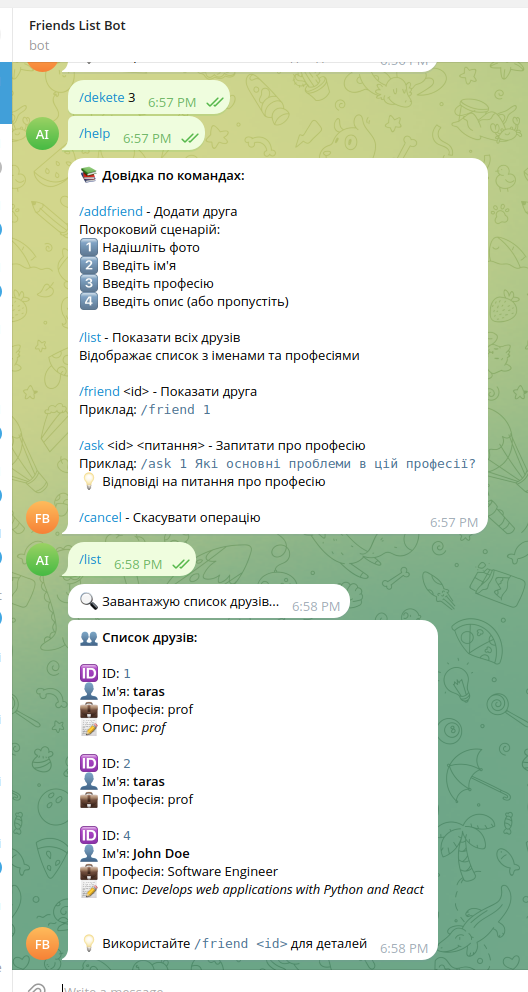

# FACIE - Friends List Service with Telegram Bot

A FastAPI-based friends list service with image storage, Telegram bot integration, and optional AI-powered question answering using LLM.

## Table of Contents

- [Features](#features)
- [Prerequisites](#prerequisites)
- [Installation](#installation)
- [Running Locally](#running-locally)
- [Running Tests](#running-tests)
- [Telegram Bot Setup](#telegram-bot-setup)
- [LLM Integration](#llm-integration)
- [Docker Deployment](#docker-deployment)
- [API Endpoints](#api-endpoints)
- [Architecture](#architecture)

---

## Features

- **Friends Management**: Create, read, update, delete friends with photos
- **Image Processing**: Automatic image validation, optimization, and JPEG conversion
- **Health Checks**: Built-in health check endpoints for monitoring
- **Telegram Bot**: Full-featured bot for managing friends via Telegram
- **LLM Integration**: Optional AI-powered Q&A about friends (OpenAI or Mock)
- **Centralized Logging**: Comprehensive logging to `/logs` directory
- **Comprehensive Tests**: 14 pytest tests
- **Docker Support**: Multi-container setup with docker-compose

---

## Prerequisites

### Required
- **Python 3.12+**
- **Poetry** (Python dependency manager)
- **PostgreSQL 13+** (for production) or SQLite (for development)
- **Docker & Docker Compose** (for containerized deployment)

### Optional
- **OpenAI API Key** (for LLM integration)
- **Telegram Bot Token** (for Telegram bot)

### Installation Commands

```bash

# Ubuntu/Debian
sudo apt-get install python3.12 python3-pip postgresql postgresql-contrib docker.io docker-compose

# Install Poetry
curl -sSL https://install.python-poetry.org | python3 -
```

---

## Installation

### 1. Clone Repository
```bash
git clone https://github.com/yourusername/facie.git
cd facie
```

### 2. Install Python Dependencies

```bash
# Install dependencies with Poetry
poetry install

# Or install only main dependencies (without dev/bot)
poetry install --without dev --without bot
```

### 3. Configure Environment Variables

Create `.env` file in project root:

```env
# Database (use SQLite for local development, PostgreSQL for production)
DATABASE_URL=sqlite:///./friends.db

# Media directory for photos
MEDIA_DIR=./media

# LLM Configuration
LLM_PROVIDER=mock              # "mock" or "openai"
OPENAI_API_KEY=sk-...          # Only needed if using OpenAI
OPENAI_MODEL=gpt-3.5-turbo    # OpenAI model choice

# Telegram Bot (only needed if running bot)
TELEGRAM_BOT_TOKEN=your_bot_token_here
BACKEND_BASE_URL=http://localhost:8000

# Logging
LOG_DIR=./logs
```

---

## Running Locally

### Option 1: Run Backend Only

```bash
# Server will be available at:
# - API: http://localhost:8000
# - Docs: http://localhost:8000/docs
# - Health: http://localhost:8000/health
```


```bash
# Build and start all services
docker compose up -d

# View logs
docker compose logs -f api
docker compose logs -f bot

# Stop all services
docker compose down
```

---

## Running Tests

### Run All Tests

```bash
# Quiet mode (minimal output)
poetry run pytest -q

# Verbose mode (see each test)
poetry run pytest -v

# Very verbose with output capture
poetry run pytest -vv
```

### Run Specific Test Categories

```bash
# Create friend tests
poetry run pytest tests/test_main.py::TestCreateFriend -q

# Get friends tests
poetry run pytest tests/test_main.py::TestGetFriends -q

# Get single friend tests
poetry run pytest tests/test_main.py::TestGetFriend -q

# Delete friend tests
poetry run pytest tests/test_main.py::TestDeleteFriend -q
```

### Test Results

All 14 tests cover:
- ✅ POST `/friends` - Create friend with photo validation
- ✅ GET `/friends` - List all friends
- ✅ GET `/friends/{id}` - Get specific friend
- ✅ DELETE `/friends/{id}` - Delete friend
- ✅ Image validation and error handling

---

## Telegram Bot Setup

### 1. Create Telegram Bot

```bash
# Open Telegram app and chat with BotFather
# Command: /newbot
# Follow instructions to get your bot token
```

### 2. Configure Bot Token

Add to `.env` file:
```env
TELEGRAM_BOT_TOKEN=your_bot_token_from_botfather
BACKEND_BASE_URL=http://localhost:8000
```

### 3. Start Bot

```bash
poetry run python -m bot.main
```

### 4. Available Commands

```
/start           - Start the bot and see available commands
/add <name> <profession> - Add new friend
/list            - Show all friends
/info <id>       - Get friend info
/ask <id> <question> - Ask question about friend
/delete <id>     - Delete friend
/help            - Show help message
```

### Example Usage





### Bot Features

- Photo upload support (camera or gallery)
- Error handling with user-friendly messages
- Logging of all interactions
___
## Postman
Use facie.postamn.collection.json for Postman.
### Example Usage
Send request



Response



Check in Telegram


---

## LLM Integration

### Configure LLM Provider

The service supports two LLM providers:

#### Option 1: Mock Provider (Default - No API Key Needed)

```env
LLM_PROVIDER=mock
```

**Response Example:**
```
For more functionality purchase Pro plan

💼 Profession: Software Engineer
📝 Description: Develops web applications
❓ Question: What do you specialize in?
```

#### Option 2: OpenAI Provider (Real AI Responses)

```env
LLM_PROVIDER=openai
OPENAI_API_KEY=sk-...                    # Get from https://platform.openai.com/api-keys
OPENAI_MODEL=gpt-3.5-turbo              # Or use gpt-4 for better quality
```

**Response Example:**
```
John specializes in full-stack development with expertise in Python, React, and PostgreSQL.
He has 5+ years of experience building scalable web applications.
```

### Using LLM in API

```bash
# Ask a question about a friend
curl -X POST "http://localhost:8000/friends/1/ask" \
  -H "Content-Type: application/json" \
  -d '{"question": "What is his specialty?"}'

# Response:
# {
#   "answer": "Based on John's profile as a Software Engineer..."
# }
```

### Using LLM in Telegram Bot

```
/ask 1 What technologies does John use?
```

Bot will:
1. Get friend info from backend
2. Send request to LLM (OpenAI or Mock)
3. Return response to user

### How It Works Internally

```
User Question
    ↓
Telegram Bot / API
    ↓
LLM Provider (Adapter Pattern)
    ├─ Mock: Returns marketing message
    └─ OpenAI: Calls Chat Completion API
    ↓
Response Back to User
```

### Error Handling

- If OpenAI API fails → Falls back to Mock provider
- If rate limited → Returns error message
- If network error → Retries automatically

---

## Docker Deployment

### Building Docker Images

```bash
# Build all images
docker-compose build

# Build specific service
docker-compose build api
docker-compose build bot
docker-compose build db
```

### Starting Services

```bash
# Start all services in background
docker-compose up -d

# Start with logs visible
docker-compose up

# Start specific service
docker-compose up api
```

### Viewing Logs

```bash
# All services
docker-compose logs -f

# Specific service
docker-compose logs -f api
docker-compose logs -f bot

# Last 50 lines
docker-compose logs --tail=50 api
```

### Stopping Services

```bash
# Stop all services
docker-compose down

# Stop and remove volumes (careful - deletes data!)
docker-compose down -v

# Stop specific service
docker-compose stop api
```

### Container Health Checks

All services have health checks configured:

```bash
# Check service status
docker-compose ps

# Manual health check
curl http://localhost:8000/health
```

---

## API Endpoints

### Friends Management

| Method | Endpoint | Description |
|--------|----------|-------------|
| POST | `/friends` | Create friend with photo |
| GET | `/friends` | List all friends |
| GET | `/friends/{id}` | Get friend by ID |
| DELETE | `/friends/{id}` | Delete friend |
| POST | `/friends/{id}/ask` | Ask question about friend (LLM) |
| GET | `/health` | Health check |


### Interactive API Documentation

```
# Swagger UI
http://localhost:8000/docs

# ReDoc
http://localhost:8000/redoc
```

---

## Architecture

### Project Structure

```
facie/
├── app/                          # FastAPI backend
│   ├── main.py                   # API routes and entry point
│   ├── database.py               # Database configuration
│   ├── models.py                 # SQLAlchemy ORM models
│   ├── schemas.py                # Pydantic schemas
│   ├── crud.py                   # Database operations
│   ├── image_utils.py            # Image processing
│   ├── logging_config.py         # Centralized logging
│   └── services/
│       └── llm.py                # LLM adapter pattern
│
├── bot/                          # Telegram bot
│   ├── main.py                   # Bot entry point
│   └── logging_config.py         # Bot logging
│
├── tests/                        # Pytest test suite
│   ├── test_main.py              # Endpoint tests
│   └── conftest.py               # Test configuration
│
├── Dockerfile                    # Backend container
├── bot/Dockerfile                # Bot container
├── docker-compose.yml            # Multi-container orchestration
│
├── pyproject.toml               # Poetry dependencies
├── .env                         # Environment variables
├── README.md                    # This file
└── DEPLOYMENT.md                # Deployment guide
```

### Technology Stack

- **Backend**: FastAPI (async Python web framework)
- **Database**: PostgreSQL (production) / SQLite (development)
- **ORM**: SQLAlchemy 2.0+
- **Image Processing**: Pillow (PIL)
- **Telegram Integration**: python-telegram-bot
- **LLM**: OpenAI API (optional)
- **Containerization**: Docker & Docker Compose
- **Testing**: Pytest with async support
- **Dependency Management**: Poetry

### Data Flow

```
Telegram Bot / HTTP Client
    ↓
FastAPI (main.py)
    ↓
CRUD Operations (crud.py)
    ↓
SQLAlchemy ORM (models.py)
    ↓
PostgreSQL / SQLite
    ↓
Response back to client
```

---

## Security Considerations

1. **Image Validation**: All images verified with Pillow (prevents fake extensions)
2. **Unique Filenames**: UUID-based naming prevents path traversal
3. **SQL Injection Prevention**: SQLAlchemy ORM parameterized queries
4. **Input Validation**: Pydantic schemas validate all inputs
5. **Environment Variables**: Sensitive data in `.env` (never commit!)

---

